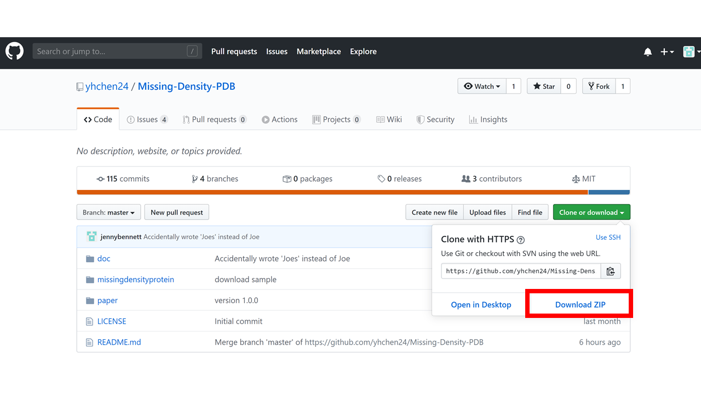

PDB autofill classifies the reason behind missing electron densities in crystallographic experimental data from the Protein Data Bank, predicts the structure of the missing densities, and predicts whether a new X-ray crystallography experiment will result in missing residues.

[](https://lbesson.mit-license.org/)
[](https://www.python.org/)
[](https://github.com/Naereen/badges)
[](http://hits.dwyl.com/yhchen24/Missing-Density-PDB)

## Table of Contents

<!--ts-->
  * [Features](#features)
  * [Example](#example)
  * [Installation](#installation)
  * [Team](#team)
  * [Support](#support)
  * [License](#license)
<!--te-->


## Features

* Classify the reason for missing residues in PDB files according to features as described below
* Data processing of PDB files. Features available to extract in this module include: protein sequences to DataFrame, resolution of experiment, maximum anisotropic B factor in protein, and number of hydrophobic/nonpolar/electrically charged/special case residues
* Prediction of missing residue coordinates.
* A sample dataset is available for use in this package for users that are new to PDB files
* See `functional_spec.py` and `component_spec.py` in the doc folder for more information on function and components.


## Example
```
# import packages
import pdb_autofill as pdb
import warnings

# ignore warnings when there is a discontinuity in PDB file
warnings.filterwarnings("ignore")

# list the names of pdb files
protein_list = ['1gey', '1gzc', '1ufo', '2hi2', '2jfk', '2o73', '2qqt', '2x82',
                '2y39', '2z91', '3d5m', '3gem', '3qun', '3ueo', '4bal', '4msw',
                '4wji', '4y79', '5uez', '7fdr']

# list the directory
directory = 'small_data/'

# classify the protein of interest
protein_of_interest = 5 (number in the filename list)

pdb.pdb_autofill(directory, protein_list, protein_of_interest
```


## Installation

The package is built with python. We recommend users use python 3.7 to run the package.

0. Before install, make sure you have the latest version of conda:

    `conda update --yes conda`

1. Install Biopython on your local machine

    `conda install biopython`

    Please see [https://biopython.org](https://biopython.org) or [https://github.com/biopython/biopython](https://github.com/biopython/biopython) for further details.

2. Install Keras on your local machine

    `conda install tensorflow`

    `conda install keras`

    Please see [https://keras.io/](https://keras.io/) or [https://github.com/keras-team/keras](https://github.com/keras-team/keras) for further details.

3. Clone the git repository in the folder in which the package will be used. Choose one of the clone methods below.

    Option 1: Clone the repository on your local machine using terminal

    `git clone https://github.com/yhchen24/Missing-Density-PDB.git`

    Option 2: Download the file directly from GitHub and unzip the components (see screenshot below)



## Team
This is Henry, You-Hsin, and Jenny's package!

## Support
Reach out at one of the following places!
* For bug reports or suggestions, please leave issues on [Github](https://github.com/yhchen24/Missing-Density-PDB)
* Twitter at [@jennybennett02](https://twitter.com/jennybennett02)

## License
[](https://lbesson.mit-license.org/)
* MIT License
