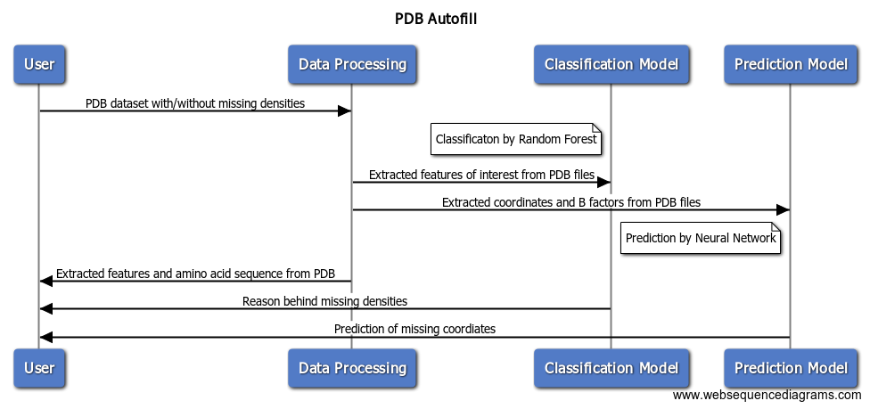

# Component Specification

## Sequence Diagram

The sequence diagram for PDB Autofill is included here to show the necessary components for classifying and predicting missing densities in PDB files in this package.

## Component Cards

Each component card describes what the component does, the inputs, the outputs, and how it interacts with other components in the package.

**User interface**
  * What it does: Collects information from the user.
  * Inputs: PDB files that include proteins with missing densities and proteins without missing densities.
  * Outputs: A collection of PDB files.
  * How it interacts with other components: Sends PDB files to the data processing component.

**Data processing**
  * What it does: Extracts amino acid sequences, experimental resolution, B factor (maximum, average, median, number over 50), sequence length, number of electrically charged residues (ARG, HIS, LYS, ASP, GLU), number of hydrophobic residues (ALA, VAL, ILE, LEU, MET, PHE, TYR, TRP), number of special case residues (CIS, GLY, PRO), number of nonpolar residues (SER, THR, ASN, GLN), and coordinates of atoms.
  * Inputs: PDB datasets from the user.
  * Outputs: Extracted features from PDB files.
  * How it interacts with other components: Sends extracted features to the classification model (random forest) component. Sends extracted coordinates and features to the prediction model (neural network) component. Sends amino acid sequence and features to user interface.

**Classification Model**
  * What it does: Classifies the reason behind missing densities in PDB files according to features extracted during data processing.
  * Inputs: Extracted features of interest from PDB files. (Features include B factor, sequence length, resolution, electrically charged, hydrophobic, nonpolar, and special case residues.)
  * Outputs: Reason behind missing densities in PDB files.
  * How it interacts with other components: Receives input from data processing component, and sends output to the user interface component.

**Prediction Model**
  * What it does: Predicts missing coordinates based on PDB training datasets and corresponding features/coordinates extracted from data processing.
  * Inputs: Extracted coordinates and features of interest from PDB files.(Features include B factor, sequence length, resolution, electrically charged, hydrophobic, nonpolar, special case residues, and coordinates.)
  * Outputs: Prediction of missing coordinates.
  * How it interacts with other components: Inputs are received from the data processing component, and outputs are sent to the user interface.

## User Interface

Any python environment can be used as the user interface with this package. For our examples we use [Jupyter Notebook](https://jupyter.org/install).

## Milestones

1. Extract a dataset from PDB consisting of 500 proteins with missing densities and 500 without missing densities
2. Extract useful information about each protein in our dataset to feed into the decision tree, random forest, and neural network
3. Milestone 1: classify the reason behind missing densities using a decision tree
4. Milestone 2 (stretch goal): predict the missing 3D coordinates using a neural network
